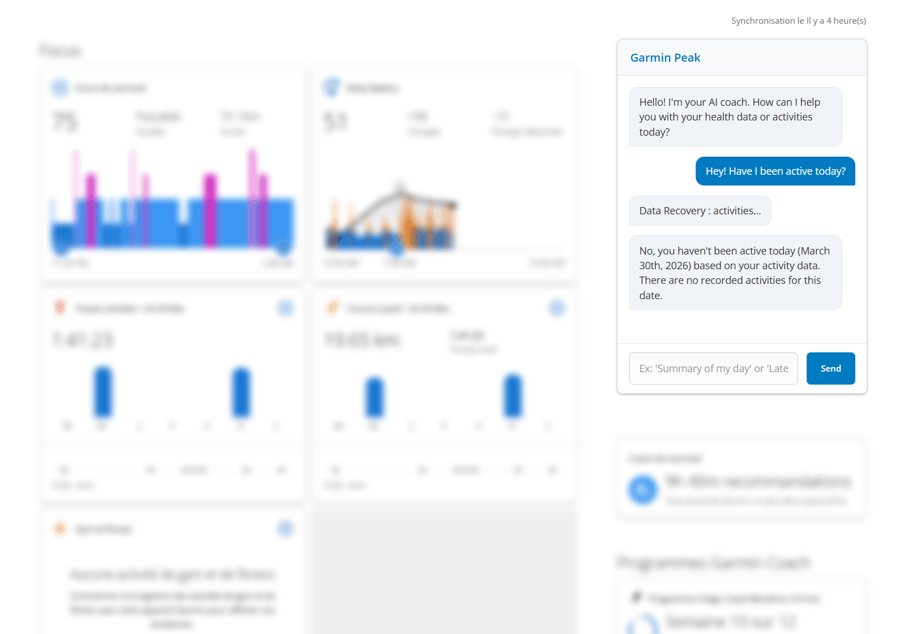

# Garmin Peak

AI-powered Chrome extension

> [!IMPORTANT]
> Garmin is a registered trademark of Garmin Ltd. or its subsidiaries. This project is an independent, open-source tool and is not affiliated with, endorsed by, sponsored by, or approved by Garmin Ltd.

## About

Garmin Peak is an extension that uses AI to analyze your activity and health data provided by Garmin Connect via your connected devices.

## Supported AI API

| Model | Compatibility |
|---|:---:|
| Ollama | ✅ |
| Groq | ✅ |
| Gemini | ✅ |
| ChatGPT | ❌ |
| Anthropic | ❌ |

> [!WARNING]
> The AI models used must be compatible with the tools. We also recommend high-performance models capable of processing large amounts of data to avoid irrelevant results.

## Installation

### 1. Clone the repository

```bash
git clone https://github.com/SkillFXX/garmin-peak.git
cd garmin-peak
```

### 2. Install dependencies

```bash
npm install
```

### 3. Configure the extension

Copy `config.example.js` into the `src` directory, rename it to `config.js`, then edit the configuration as needed.

#### Linux / macOS

```bash
cp src/config.example.js src/config.js
```

#### Windows (Command Prompt)

```cmd
copy src\config.example.js src\config.js
```

### 4. Build the extension

```bash
npm run build
```

### 5. Load the extension into Chrome

1. Open `chrome://extensions/`
2. Enable **Developer mode**
3. Click **Load unpacked**
4. Select the generated `dist` folder

## Preview


